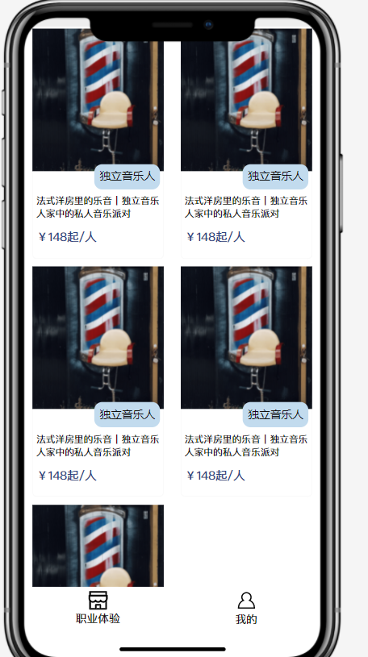

# Wechat app train
# 探元素小程序开发技术栈

1. Typescript ：typescript是js的超集，增加了一些编译阶段的语法糖，增加了js的可读性
2. 原生微信小程序开发框架

# 推荐学习路线（按顺序）
1. 熟悉回顾基础的HTML+CSS+JS, 重点回顾理解HTML的DOM结构，CSS的盒子模型，这些知识网上许多资源，这是我之前略微总结的[blog](https://www.jianshu.com/p/b06a7deedcb0)，可以稍微看下。
2. 熟悉小程序[官方开发文档](https://developers.weixin.qq.com/ebook?action=get_post_info&docid=000e8842960070ab0086d162c5b80a), 重点熟悉小程序生命周期，渲染与逻辑的分离，flex布局，理解小程序与常规web app的区别。

# Little project
## 介绍

实现一个小程序，ui大致如下

## 要求
1. 主页为N张卡片（N>3）,每个卡片为图片+文字的形式，图片文字不限，点击图片将会跳转到卡片详情页，详情页只展示其对应文字。
2. 下方有两个导航项（职业体验和我的）,职业体验展示卡片列表，我的展示为空白，要求支持导航，图标随意。
3. 卡片布局使用flex布局。